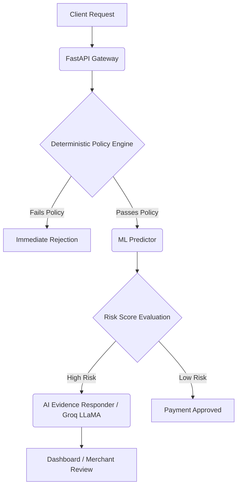

<div align="center">
  <h1>RiskWise</h1>
  <p><b>Merchant Chargeback Risk Manager</b></p>
  <p>
    
    
    
    
  </p>
</div>

<p align="center">
  RiskWise predicts chargeback-prone transactions, explains the behavioral and payment evidence behind the prediction, and helps merchants decide what to review or verify before money is lost.
</p>

## 📑 Table of Contents

- [🎯 Track: AI Risk Manager](#-track-ai-risk-manager)
- [✨ Features](#-features)
- [🏗️ Architecture](#️-architecture)
- [🛠️ Tech Stack](#️-tech-stack)
- [🚀 Getting Started](#-getting-started)
- [🔐 Security Architecture](#-security-architecture)
- [🤖 Agentic Payment Applicability](#-agentic-payment-applicability)
- [⚠️ Known Limitations](#️-known-limitations)
- [📄 Documentation](#-documentation)

## 🎯 Track: AI Risk Manager

RiskWise is designed to solve a direct merchant pain point: **Chargebacks and Fraudulent Payments**. It combines a predictive Machine Learning model, a deterministic Policy Engine, and an AI-driven Evidence Responder to securely evaluate payments. We chose the **AI Risk Manager** track because the product's core mechanic — real-time risk scoring with deterministic policy override — is a direct fit for this category.

## ✨ Features

- **ML Chargeback Predictor:** Scikit-learn HistGradientBoosting model (selected over Logistic Regression for better handling of non-linear feature interactions) trained on temporal transaction data.
- **Deterministic Safety:** Hard limits (e.g., Max Amount) that strictly override ML/AI predictions.
- **AI Evidence Responder:** LLM-powered context generation that acts as an advisory agent to explain why a payment is risky.
- **Merchant Dashboard:** Real-time visibility into Estimated Prevented Loss, Prediction Accuracy, and Review Queues.
- **Model Evaluation Metrics:** Transparent display of Precision, Recall, F1, and False Positive Cost based on a rigorously held-out test set.

## 🏗️ Architecture



## 🛠️ Tech Stack

### Backend
- **Framework:** FastAPI, Python
- **Database:** SQLAlchemy, SQLite (Development)
- **Machine Learning:** Scikit-Learn

### Frontend
- **Framework:** React, TypeScript, Vite
- **Styling:** TailwindCSS

### AI Integration
- **LLM:** Groq (LLaMA 3.3 70B) via standard API

## 🚀 Getting Started

### 1. Setup Backend

```bash
# Create and activate virtual environment
python3 -m venv venv
source venv/bin/activate

# Install dependencies
pip install -r requirements.txt
pip install scikit-learn pandas numpy

# Generate synthetic dataset and train the ML model
python train_model.py

# Seed the database
python seed.py

# Start the server (with mock AI for testing)
AI_PROVIDER=mock uvicorn main:app --port 8000
```

### 2. Setup Frontend

```bash
cd frontend
npm install
npm run dev
```

### 3. Environment Variables

RiskWise supports two distinct AI modes:

#### Mock AI Mode (Testing/Demo)
```bash
AI_PROVIDER=mock
```
- Requires no API key.
- Deterministic and rule-based for consistent test reproducibility.
- Identifiable in the UI via the "Mock (Rule-based)" badge.

#### Real AI Mode (Production)
```bash
AI_PROVIDER=real
AI_API_KEY=your_groq_api_key
AI_MODEL=llama-3.3-70b-versatile
```
- Requires configured provider credentials.
- In both modes, the AI is strictly **advisory only**. The deterministic policy engine remains authoritative and will override AI recommendations if hard policy limits are violated.

## 🔐 Security Architecture

- **Defensive Only:** The system analyzes payments but does not execute them or manipulate financial ledgers.
- **AI Advisory Boundary:** The LLM's role is strictly to *explain* evidence. It cannot override deterministic policy constraints.
- **Temporal Leakage Prevention:** The ML model is evaluated on a chronological split, preventing future information from leaking into training.

## 🤖 Agentic Payment Applicability

The same pipeline — deterministic policy engine, risk signals, ML score, LLM evidence — applies unchanged when the payer is an autonomous agent rather than a human. The risk inputs (amount, recipient novelty, velocity, account history, device fingerprint) don't change based on who initiated the payment. Whether a human taps "Pay" or an AI commerce agent executes a purchase on behalf of a user, RiskWise evaluates the transaction identically and enforces the same deterministic guardrails.

## ⚠️ Known Limitations

- **SQLite:** Used as the development database for contest simplicity. In production, this would be replaced with PostgreSQL (or equivalent ACID-compliant RDBMS) for concurrency, durability, and scale.
- **Naive Datetimes:** The codebase uses `datetime.utcnow()` (timezone-naive) in several places. A production deployment would enforce timezone-aware UTC timestamps (`datetime.now(timezone.utc)`) throughout.
- **Synthetic Data:** All metrics and financial figures are derived from synthetic contest data and should not be interpreted as Razorpay production benchmarks.

## 📄 Documentation

- 📊 [ML Model Audit](docs/ml_model_audit.md)
- 📝 [Model Card](docs/model-card.md)
- 🔍 [Final Judge Audit](docs/final_judge_audit.md) — Internally audited across ML integrity, security, and engineering quality prior to submission; findings and fixes are documented in this file.

---
<div align="center">
  Built with ❤️ for secure payments.
</div>
